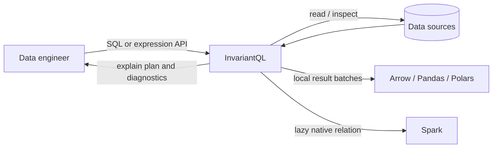

# InvariantQL architecture

## Purpose

This directory records the architectural intent of InvariantQL before runtime
implementation begins. It exists to preserve *why* the system is shaped as it
is, including the forces, rejected alternatives, consequences, and conditions
that should cause a decision to be revisited.

The architecture is a set of trade-offs, not a claim that one structure is
universally best. Each decision is paired with fitness functions so that the
architecture can be tested rather than merely described.

## Architectural thesis

An invariant remains unchanged under transformation. InvariantQL preserves the
meaning of a logical query while the physical source, file format, and execution
engine change.

The first product promise is:

> Define a read-only logical query once, preview it on a bounded local sample,
> validate its portability, and compile the same plan for a production engine
> such as Spark.

The invariant is the typed logical query plan. Native SQL, Mongo pipelines,
Arrow scans, Pandas objects, and Spark DataFrames are boundary representations;
none of them defines the core model.

## System context

InvariantQL is a Python library, not a hosted service or orchestrator. It does
not own source availability, cluster scheduling, credential issuance, or data
governance. It must integrate with those concerns without silently taking
ownership of them.

## Architectural style

InvariantQL will be a modular library using ports and adapters:

- The domain core owns typed schemas, expressions, logical plans, and
  capabilities.
- The application layer coordinates validation, planning, execution, and
  explanation.
- Ports describe required source, storage, format-handler, and engine behavior.
- Adapters translate third-party APIs and native execution models at the edge.
- A small public facade keeps the internal modularity out of the common user
  path.

Dependencies point inward. In particular, the domain must not import Spark,
Pandas, PyArrow, fsspec, SQLGlot, database clients, or cloud SDKs.

## Design principles

1. **Preserve semantic intent.** Unsupported behavior is rejected or executed
   as a visible residual operation; it is never silently discarded.
2. **Make expensive behavior explicit.** Collection, staging, cross-system data
   transfer, and non-atomic moves require an explicit API action.
3. **Prefer capability evidence over taxonomy.** A source is described by what
   it can do, not only by labels such as structured or unstructured.
4. **Keep the plan independent of syntax and engines.** SQL is one frontend and
   Spark is one backend.
5. **Prefer manageable connascence.** Components share stable names and types
   through narrow protocols and immutable value objects; they do not share
   call ordering, provider internals, or mutable dictionaries.
6. **Explain every optimization.** Pushdown decisions are inspectable and
   testable.
7. **Keep the portable path deliberately smaller than native engines.** Native
   escape hatches may exist, but they visibly surrender portability.

## Scope boundaries for the first implementation

### In scope

- Read-only, single-source queries.
- A deliberately small SQL projection/filter/limit profile, expanded only with
  cross-engine conformance evidence.
- File-backed sources composed from storage and a `DataFormat` description.
- Local preview with bounded materialization.
- Native lazy compilation for Spark.
- Arrow batches as the local/interchange result boundary.
- Capability-aware pushdown and a structured explain plan.
- Explicit staging when an engine cannot reach a source directly.

### Explicitly out of scope

- Cross-source joins or a federated cost-based query optimizer.
- Transparent writes, transactions, CDC, or reverse ETL.
- Pipeline orchestration, scheduling, retries across workflows, or a hosted
  control plane.
- Full ANSI SQL or automatic portability of arbitrary Python/Pandas code.
- Implicit collection of distributed data into the Python process.
- Pretending that object stores provide atomic filesystem semantics.

These exclusions reduce the semantic and operational surface while the query
contract is proven. They may be revisited through new ADRs.

## Documentation map

- [Logical components](components.md)
- [Architectural characteristics](characteristics.md)
- [Architecture fitness functions](fitness-functions.md)
- [ADR template](decisions/0000-adr-template.md)

## Decision register

| ADR | Decision | Status |
| --- | --- | --- |
| [0001](decisions/0001-modular-hexagonal-library.md) | Use a modular ports-and-adapters library architecture | Accepted |
| [0002](decisions/0002-logical-query-plan.md) | Make an immutable logical query plan the invariant core | Accepted |
| [0003](decisions/0003-capability-aware-planning.md) | Plan pushdown from explicit capabilities and residuals | Accepted |
| [0004](decisions/0004-separate-architectural-axes.md) | Separate storage, data format, source, and engine | Accepted |
| [0005](decisions/0005-engine-specific-result-boundaries.md) | Use Arrow locally and retain Spark's native lazy relation | Accepted |
| [0006](decisions/0006-sql-frontend.md) | Treat SQLGlot-backed SQL as a validated frontend | Accepted |
| [0007](decisions/0007-single-source-first.md) | Limit the initial query model to one source | Accepted |
| [0008](decisions/0008-sync-planning-async-execution.md) | Keep planning synchronous and make async execution explicit | Accepted |
| [0009](decisions/0009-use-uv.md) | Use uv for dependency and contributor workflows | Accepted |
| [0010](decisions/0010-optional-integration-boundaries.md) | Isolate optional integrations and defer plugin discovery | Accepted |
| [0011](decisions/0011-duckdb-local-engine.md) | Use DuckDB as the local execution engine | Accepted |
| [0012](decisions/0012-first-release-scope.md) | First release scope, supported platforms, and licence | Accepted |
| [0013](decisions/0013-credential-model.md) | Credentials stay inside adapters as opaque, redacted values | Accepted |
| [0014](decisions/0014-clean-break-from-legacy-connectors.md) | Clean break from the legacy connectors library | Accepted |

## Change policy

Architecture documents and ADRs change through review. An accepted ADR is not
edited to hide a superseded decision; a new ADR supersedes it. Numerical fitness
thresholds may be calibrated after a measured baseline, but weakening a safety
or semantic threshold requires an ADR.
