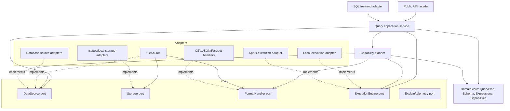

# Logical components

## Component map



Arrows in the diagram show logical use, not necessarily Python import direction.
Adapters implement inward-facing ports and may depend on third-party packages;
the domain never depends on an adapter.

## Responsibilities

### 1. Public API facade

**Role:** Give users a small, typed entry point for connecting, defining a
query, previewing it, explaining it, validating portability, and selecting an
execution engine.

**Owns:**

- Stable public names and user-oriented errors.
- Convenience construction and explicit materialization methods.
- The distinction between portable operations and native escape hatches.

**Does not own:** SQL parsing, provider SDK calls, query optimization, or native
DataFrame behavior.

The facade is intentionally simpler than the internal model. Its purpose is to
reduce user connascence with module layout without turning into a god object.

### 2. SQL frontend adapter

**Role:** Parse and validate the supported read-only SQL profile, then translate
it into the domain `QueryPlan`.

**Owns:**

- SQL syntax errors and source-span diagnostics.
- Rejection of multiple statements, DDL, DML, and unsupported constructs.
- Parameter placeholders and safe literal handling.
- Translation from the SQLGlot AST to domain expressions.

**Does not own:** The canonical query representation or backend SQL generation.
SQLGlot types stop at this boundary.

### 3. Domain core

**Role:** Represent meaning independently of source syntax and execution engine.

**Owns:**

- Immutable `QueryPlan`, expression, schema, field, type, and source-reference
  value objects.
- Capability identifiers and support levels.
- Semantic validation rules that apply to every backend.
- Deterministic plan equality/fingerprinting and diagnostic codes.

**Does not own:** I/O, credentials, SQL strings, Spark objects, Arrow objects, or
third-party exception types.

The domain is the most stable component and therefore accepts the strongest
static connascence of name and type. Changes to its public vocabulary require
compatibility review.

### 4. Query application service

**Role:** Orchestrate the use cases without embedding provider behavior.

**Owns:**

- `explain`, `validate_for`, bounded local preview, compile, execute, and submit
  workflows.
- Resource lifetime and error translation at use-case boundaries.
- Selecting the planner and explicit staging workflow.

**Does not own:** Capability claims, native compilation rules, or result storage.

### 5. Capability planner

**Role:** Determine where every operation will execute.

**Owns:**

- Combining source, storage, format-handler, and engine capabilities.
- Splitting a plan into pushed, residual, and rejected operations.
- Preserving the correctness invariant that no operation disappears.
- Producing a structured, stable explain plan.
- Reporting why an operation was or was not pushed.

**Does not own:** Physical cost-based join ordering or cluster scheduling.

A partial pushdown may be rechecked by a residual filter. Duplicate evaluation
is acceptable when required for correctness; missing evaluation is not.

### 6. `DataSource` port and source adapters

**Role:** Expose a logical tabular relation and translate planned operations to a
source-native scan/query.

**Owns:**

- Schema discovery.
- Source capability evidence.
- Native query/scan compilation and source-specific diagnostics.
- Cursor/stream lifecycle at the source boundary.

Examples include a file-backed source, a SQL database source, and a future
document-source adapter. A source is not classified as merely structured or
unstructured; its capabilities describe projection, predicates, limits,
aggregation, ordering, streaming, and other behavior.

### 7. `Storage` port and adapters

**Role:** Locate and access bytes or objects without claiming tabular meaning.

**Owns:**

- Opening/range-reading objects, listing, metadata, copy, delete, and explicitly
  characterized rename behavior.
- Storage capabilities such as random access, range reads, hierarchical
  directories, atomic rename, and engine-visible URIs.
- Credential references required to access a location.

**Does not own:** CSV parsing, DataFrame construction, filters, or SQL.

Object-store moves that require copy-and-delete must not be presented as atomic
rename. The distinction is visible through capabilities and result diagnostics.

### 8. `DataFormat` and format handlers

**Role:** Describe how file-backed bytes represent tabular data and let an engine
interpret that description.

`DataFormat` is an immutable, typed description such as `CsvFormat` or
`ParquetFormat`; it replaces mutable dictionaries and string comparisons. A
format handler is the engine-facing Strategy that turns a format description
into a local scanner or a native Spark reader configuration.

**Owns:**

- Format-specific schema/options and potential scan capabilities.
- Translation of typed options to an engine-native reader.
- Format diagnostics.

**Does not own:** Remote authentication, query semantics, or the final execution
engine.

### 9. `ExecutionEngine` port and engine adapters

**Role:** Compile or execute a logical plan within a concrete execution model.

**Owns:**

- Engine capability evidence and type/function mappings.
- Native plan construction.
- Local residual execution.
- Engine-specific result boundary and lifecycle.

The local engine produces streaming Arrow batches. After schema binding, the
Spark adapter produces a native lazy Spark relation and must not collect or
write data. Schema discovery remains a separate, visible inspection step.

### 10. Result and materialization boundary

**Role:** Make materialization explicit and type-safe.

**Owns:**

- Local Arrow batch streaming and bounded conversions to Pandas/Polars.
- Distributed-result metadata without pretending a Spark relation is local.
- Limits and warnings around driver collection.

There is deliberately no return type of `PandasDataFrame | SparkDataFrame` that
requires runtime `isinstance` branching.

### 11. Explicit staging service

**Role:** Move data to an engine-visible location when direct access is
impossible.

**Owns:** transfer planning, destination choice, transfer diagnostics, cleanup
policy, and an explicit user confirmation boundary for expensive movement.

Staging is not part of ordinary query compilation and is never silently
performed.

### 12. Cross-cutting support

Configuration, credential redaction, diagnostic codes, logging, metrics, and
optional-adapter registration support the components above. They must remain
narrow services rather than a shared utility bucket. Credentials are opaque
references at domain boundaries and never appear in plans, fingerprints, or
logs.

## Pattern vocabulary

Patterns name the coupling we intend to control; they are not goals by
themselves.

| Pattern | Deliberate use | Boundary it protects | Trade-off |
| --- | --- | --- | --- |
| Facade | The public API presents a small workflow over application services and registration | Users depend on stable use cases, not internal module structure | The facade must delegate and can become a god object if provider logic enters it |
| Adapter | SQL, source, storage, format, and engine adapters translate external contracts to inward-facing ports | Provider types and release churn remain at the edge | Every adapter needs translation and contract tests |
| Strategy | A selected format handler and execution engine supply replaceable behavior for a plan | Selection does not require provider conditionals in the domain | Strategy interfaces must reflect real substitutability, not forced sameness |
| Bridge | Source/storage/format abstractions vary independently from execution engines and are joined by planning/composition | Avoids a class for every provider-format-engine combination | Invalid combinations must be detected through capabilities and diagnostics |
| Factory | Named construction helpers assemble adapters and validate optional dependencies | Object-graph wiring stays out of the facade and user code | Registration names become a compatibility surface |

The first design does not require Decorator or a mutable Builder. Decorators are
appropriate later for telemetry or caching only when they preserve the wrapped
port's contract. Fluent query methods may provide builder-like ergonomics, but
they return new immutable plans; construction syntax does not own query state.

## Dependency rules

The Python packages follow these constraints:

```text
invariantql.domain       -> Python standard library only
invariantql.ports        -> domain
invariantql.application  -> domain + ports
invariantql.api          -> application + domain + registration facade
invariantql.adapters.*   -> domain + ports + third-party integration
```

- `domain`, `ports`, and `application` never import `adapters`.
- Adapters do not import one another; composition happens at the bootstrap/API
  boundary.
- Provider packages are optional and cannot be imported during a base-package
  import.
- Third-party types do not cross domain or general-purpose ports. The only
  deliberate exception is an explicitly engine-specific result boundary, such
  as a lazy Spark relation. Stable domain names replace connascence with provider
  implementation and call order.

Executable architecture tests enforce these rules as the package evolves.

## Primary execution flows

### Local preview

```text
SQL -> SQL frontend -> QueryPlan -> add explicit preview limit
    -> capability planner -> local/source pushdown + residual plan
    -> local engine -> Arrow batches -> optional bounded Pandas conversion
```

### Spark compilation

```text
same QueryPlan -> portability validation -> capability planner
    -> Spark-native reader/relation -> lazy Spark DataFrame
```

If Spark cannot reach the source URI, compilation fails with a staging-required
diagnostic. The user may then invoke the explicit staging use case.

## Vocabulary

| Term | Meaning |
| --- | --- |
| Logical plan | Engine- and syntax-independent representation of query intent |
| Source | A logical tabular relation that can expose schema and execute/compile scans |
| Storage | Physical access to objects or byte streams |
| Data format | Typed description of how file bytes represent tabular data |
| Engine | Runtime that compiles or executes a plan |
| Pushdown | Operation executed by the source/reader instead of a later engine stage |
| Residual | Operation that remains to be evaluated after pushdown |
| Materialization | Bringing a result into local memory or durable storage |
| Portable profile | Operations with tested equivalent semantics on selected targets |
| Native escape hatch | Explicit backend-specific behavior with no portability promise |
